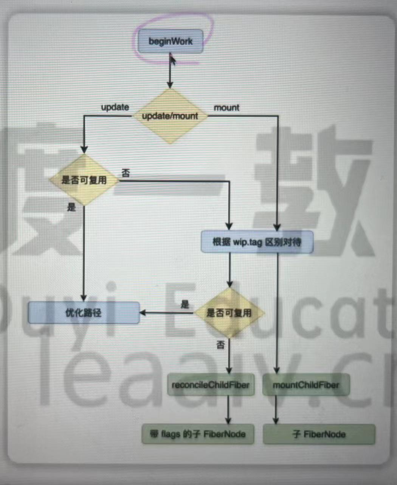
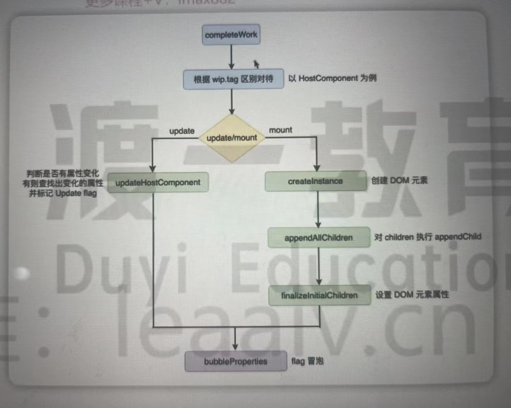

### 协调器

> reconciler 协调器 是render的的阶段 整个阶段可以分为递和归
+ 递 beginWork
+ 归 completeWork
#### beginWork 工作流程
>beginWork 方法主要是根据传入的fiberNode创建下一级的FiberNode 

+ 如何判断是否是第一次渲染 判断CurrentFiberNode是否存在
+ update 
  + 判断是否可以复用 判断wipFiberNode是否可以复用 后缓冲区
  + 根据reconcileChildFiber 生成下一级 diff算法
  + 不能复用 那么update 和 mount流程大体一致 主要区别在于是否会生成带有副作用标记flags的FiberNode
+ 根据不同的tag处理完FiberNode之后
  + 如果是mount 进入mountChildFiber
  + 如果是update 进入的是reconcilerChildFiber
  + 这两个方法实际上都是childReconciler方法的返回值
```js
    /**
     * @params {Boolean} shouldTrackSideEffect 是否追踪副作用
     * true update false mount
     */
    function childReconciler(shouldTrackSideEffect){

    }
```
#### completeWork 工作流程
与beginWork类似 completeWork 也会根据wip.tag 区分对待 流程主要包括两个步骤
+ 创建元素或者标记元素的更新
+ flags冒泡
整体流程图如下：

##### mount阶段 以hostComponent为例
  + 通过createInstance方法创建fiber对应的dom元素
  + 通过appendAllChildren 将下一层的dom元素通过createInstance插入到所创建的dom元素中
  + hostComponent 原始元素 hostText 文本节点
  + finalizeInitialChildren方法 完成属性的初始化 主要包含以下几类属性
    + styles  setValueForStyle
    + innerHTML setInnerHTML
    + 文本类型children setTextContent
    + 不会在DOM中冒泡的事件 包含cancel close invalid load scroll toggle
    + 其他属性 setValueForProperty
  +  最后进行flags冒泡
##### update阶段 以hostComponent为例
主要对属性更新的标记
 + updateHostComponent 主要逻辑 是diffProperty方法里 这个方法会包含两次遍历
   + 第一次遍历主要是标记前更新有 更新后没有的属性 标记删除的属性
   + 第二次主要是标记更新前后有变化的属性 标记更新的属性
 + 所有更新了的属性的key和value会保存在当前FiberNode updateQueue里面 数据是以key value相邻的形式保存 并且当前fiberNode会标记update
 ```js
 flags  |= Update 
 ```
##### flags冒泡
 > 当整个reconciler完成后 会得到一个wipFiberTree 这些FiberNode中有一些标记了flags 有一些没有标记 如何高效的找到整棵树中有flags的节点
subTreeFlags 会收集子元素的标记
#### 图解diff算法
diff current FiberNode 和jsx元素进行对比 生成新的wip FiberNode
为了降低时间复杂度 react对diff算法做了三个限制
+ 限制一 只对同级别元素进行diff 如哦dom元素在两次更新中跨越了层级 react不会尝试复用他
  + 单节点diff 新节点是单节点 旧节点数量不固定 是否可以复用遵循以下流程
    + 判断可以是否相同 如果没有key 也属于相同的情况
       + 如果key相同 进入步骤二
       + 如果不相同 如果有兄弟节点 还会遍历兄弟节点
    + 再判断type是否相同 
      + 如果type相同 复用
      + 如果type不同 无法复用 并且兄弟节点也一并标记为删除
  + 多节点diff
    + react团队发现 在日常开发中 对节点的更新操作往往多过对节点的新增 删除 移动 因此在进行多节点diff时 会进行两轮遍历
      + 第一轮会尝试逐个的复用节点 从前往后依次遍历 
         + 新旧节点key type都相同 直接复用
         + 新旧key相同 type不同 会根据reactElement生成一个全新的fiber 旧的会放入deletions数组里 统一删除 遍历并不会种植
         + key不同 结束遍历 ？？？
      + 第二轮会处理上一轮遍历中没有处理完的节点
        + 如果被提前终止 意味着有新的react元素 或旧的 FiberNode没有遍历完
        + 1.只剩下旧子节点 将子节点添加到deletions
        + 2.只剩下新的jsx元素怒 根据新的react元素来创建FiberNode
        + 3.1新旧节点都有剩余 将剩余FiberNode放入一个map 遍历剩余的新jsx元素 然后去寻找是否可以复用的fiberNode节点 能找到就服用 （移动）
        + 3.2 如果找不到 新增 遍历完 将map中剩余的fiberNode放入deletions
+ 限制二 标签不同会直接销毁 有key可能会复用 生成新树
+ 限制三 开发者可以通过key来暗示那些子元素能够保持稳定
##### 双端对比算法 react暂时只是单向的 react 虚拟dom现在是单向链表
 头尾一起遍历 每次都会 头头 头尾 分别进行比较


